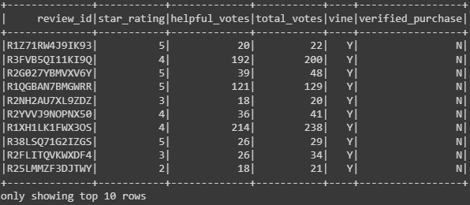
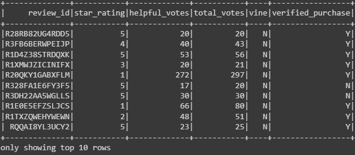
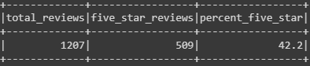
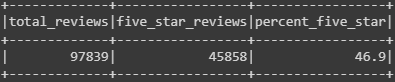

# Amazon Vine Analysis

## Overview of Analysis
The Amazon Vine program allows for companies to pay a small fee to have reviewers that are a part of the program review their product; this analysis was performed to determine the presence of bias towards leaving positive reviews in the program using a dataset of 2015 Amazon reviews in the Kitchen category. Due to the large size of the Amazon review dataset an ETL pipeline was set up using PySpark on Google Colaboratory with the data being stored in an Amazon Web Services RDS database. The analysis was also performed using PySpark.

## Results
Reviews that were considered for the analysis were filtered from the entire dataset: reviews that had over 20 or more votes where at least 50% of the votes were considered helpful by users were kept. From these votes 2 DataFrames were made: reviews that were a part of the Vine program and ones that were not.

| Reviews in Vine Program | Reviews not in Vine Program | 
| :---: | :---: |
|  |  |

To determine the existence of a positivity bias the percentage of reviews that rated products 5 stars were calculated.

| Reviews in Vine Program | Reviews not in Vine Program |
| :---: | :---: |
|  |  |

* Total Reviews: 97,839 non-Vine reviews, 1,207 Vine reviews
* Total Reviews Rated 5 Stars: 45,858 non-Vine reviews, 509 Vine reviews
* Percentage of 5 Star Reviews: 46.9% 5 star non-Vine reviews, 42.2% 5 star Vine reviews

## Summary
For reviews in the kitchen category there doesn't appear to be any positivity bias for reviews in the Vine program as the percentage of the total number of reviews that rated the product 5 stars is actually lower than for reviews that are not a part of the program. For a more complete picture examining the percentage of 1 star reviews between the two groups, as it is also possible a positivity bias could exist for paid participants to at least not rate a product low at a rate higher than those who are not paid. Plotting the frequency distributions for the star_rating in each column could also be useful for comparing the distribution of reviews between the two groups.
